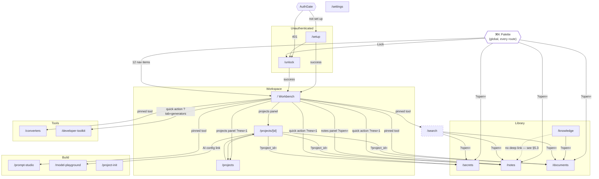
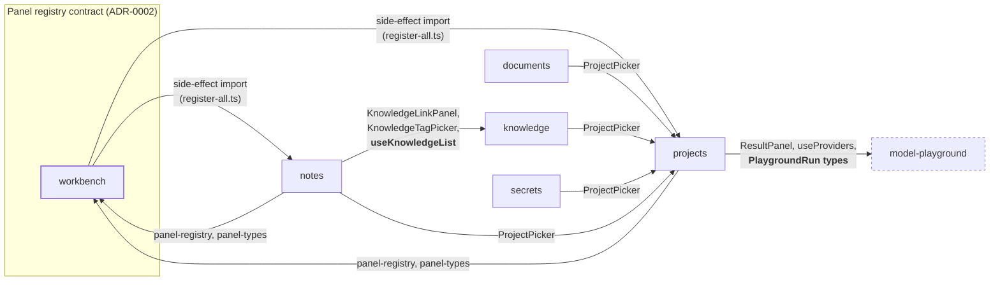

# Frontend Reimagine — Screen Dependency Graph

> **Purpose:** The navigation and dependency topology of the Forge frontend — which screens reach which, which features depend on which, and what that implies for migration order and regression coverage. Complements the flat route inventory in [`00_AUDIT.md`](00_AUDIT.md) §2.3.
> **Scope:** This phase only. Extracted from the shipped codebase, not from the sidebar.
> **Ownership:** TODO — assign a phase owner.
> **Status:** Complete — extracted 2026-08-06.
> **Version:** 1.0.0
> **Last Updated:** 2026-08-06
> **Depends On:** [00_AUDIT.md](00_AUDIT.md)

---

## 1. Method

Every edge below was extracted mechanically from source, not reconstructed from the navigation UI:

- **Navigation edges** — every `router.push`, `router.replace`, and `<Link href>` in `app/`, `features/`, and `components/`.
- **Feature edges** — every `@/features/<other>` import, per feature folder.
- **Composition edges** — every `@/features/*` import in each route file.

The point of doing it mechanically is that hidden navigation is, by definition, not visible in the nav.

**It changed three conclusions.** §5.1 corrects a claim in [`00_AUDIT.md`](00_AUDIT.md) §8 that was too generous, §5.2 records two module cycles that constrain migration order, and §5.3 is a new inconsistency the route inventory could not have shown.

## 2. Navigation graph



## 3. Inbound reachability — who can actually reach each screen

The column that matters. "Sidebar + palette" is available to every route and is omitted; this table lists **additional** in-app entry points.

| Screen | Additional inbound edges | Reachability |
|---|---|---|
| `/` Workbench | `/setup`, `/unlock` on success | Landing route |
| `/secrets` | Palette results, Workbench quick action, Workbench pinned tile, `/search` results, `/projects/[id]` | **Highest — 5 sources** |
| `/notes` | Palette results, Workbench quick action, Workbench notes panel, `/search` results, `/projects/[id]`, `/knowledge` | **Highest — 6 sources** |
| `/documents` | Palette results, Workbench pinned tile, `/search` results, `/projects/[id]`, `/knowledge` | High — 5 sources |
| `/projects/[id]` | `/projects`, Workbench projects panel | 2 sources |
| `/projects` | `/projects/[id]` back, Workbench projects panel | 2 sources |
| `/developer-toolkit` | Workbench quick action, Workbench pinned tile, 3 redirects | 5 sources |
| `/converters` | Workbench pinned tile, `/ingest` redirect | 2 sources |
| `/prompt-studio` | Workbench pinned tile | 1 source |
| `/model-playground` | `/projects/[id]` AI config link | **1 source** |
| `/search` | Workbench pinned tile **only** | ⚠️ **1 source — and not the sidebar or palette** |
| `/knowledge` | — | **Sidebar/palette only** |
| `/project-init` | — | **Sidebar/palette only** |
| `/settings` | — | Sidebar/palette only (correct for utility nav) |

**Isolated screens** — reachable only from the sidebar and palette, with no contextual entry from any other screen: `/knowledge`, `/project-init`, `/settings`. For `/settings` that is correct. For `/knowledge` it is notable: the Library's browse-and-organize surface has no inbound link from Notes or Documents, the two things it organizes.

**`/search` remains the outlier** — the one route with no sidebar and no palette entry, reachable only if the user has pinned it on the Workbench. This is the finding [ADR-0016](../../decisions/0016-grouped-navigation-and-search-surface-consolidation.md) §2.2 resolves.

## 4. Feature dependency graph



**Ten cross-feature edges across six features.** `converters`, `crypto`, `generators`, `utilities`, `ingest`, `prompt-studio`, `project-init`, `search`, `settings`, and `auth` have **zero** outgoing feature dependencies — they are cleanly isolated and can be migrated in any order.

## 5. What the graph exposed

### 5.1 Correction: the cross-feature boundary is not clean

[`00_AUDIT.md`](00_AUDIT.md) §8 stated that features "do not import each other's internals" and that `ProjectPicker` was "the one place features touch." **That was too generous, and it is corrected here.**

[`../../07_CODING_STANDARDS.md`](../../07_CODING_STANDARDS.md) states the rule without qualification: *"**Features don't import from each other.** `features/vault` never imports from `features/notes`. Shared code goes in `lib/` or `components/`."*

Against that rule, the codebase has ten violations, in three distinct categories:

| Category | Edges | Assessment |
|---|---|---|
| **Registry contract** — `notes`/`projects` importing `workbench/panel-registry` + `panel-types`, and `workbench/register-all` side-effect-importing both | 4 | **Intended.** This is the plugin inversion [ADR-0002](../../decisions/0002-workbench-panel-architecture.md) designed, and `workbench-grid.tsx` carries a careful comment explaining the import ordering. The standard simply doesn't have language for a registry pattern. |
| **Public component reuse** — `ProjectPicker` (×4), `KnowledgeLinkPanel`, `KnowledgeTagPicker` | 6 call sites | **Pragmatic.** These are public feature components, not internals. Technically against the rule as written; defensible in practice. |
| **Data-layer reach-through** — `notes/note-card.tsx` → `useKnowledgeList` from `knowledge/api`; `projects/api.ts` + two components → `model-playground/api` types and `useProviders` | 2 features | ⚠️ **The genuine coupling.** A feature component consuming another feature's query hooks and types is different in kind from rendering its component. `projects → model-playground` is the deepest edge in the codebase: three files, including `api.ts` importing another feature's types. |

**This is not Phase 09's to fix.** It is architectural debt, not presentation debt, and repairing it means either relaxing the standard or introducing a shared layer — a decision that belongs to the project owner and probably to its own phase. Phase 09's obligation is narrower: **do not make it worse**, and respect it in migration order (§6). Recorded as a Known Issue in [`CURRENT_STATE.md`](CURRENT_STATE.md).

### 5.2 Two module cycles, both from the registry pattern

```
workbench → notes → workbench
workbench → projects → workbench
```

Both are the intended shape of a registration inversion: the registry owns the contract, features register into it, and one central module (`register-all.ts`) triggers registration. They are not accidental coupling.

They do have a concrete migration consequence: **`workbench`, `notes`, and `projects` cannot be migrated in full isolation from one another.** T9 (Workbench) touches panel cards that `notes/workbench-panel.tsx` and `projects/workbench-panel.tsx` render into, and T14/T15 touch those files. Reflected in §6.

### 5.3 New finding: Knowledge Hub cannot deep-link to a note

`features/knowledge/knowledge-result-row.tsx:19`:

```ts
function targetHref(item: KnowledgeItem): string {
  return item.type === "document" ? `/documents?open=${item.id}` : "/notes";
}
```

Clicking a **document** result opens that document. Clicking a **note** result drops the user on the bare Notes board with no indication of which note they clicked — on an infinite spatial canvas that may hold hundreds.

This is inconsistent with the two other surfaces that link to notes, both of which deep-link correctly:
- `components/command-palette/command-palette-provider.tsx:103` → `/notes?open=${n.id}`
- `features/search/search-result-list.tsx` → `/notes?open=${n.id}`

So `?open=` on `/notes` is a working, already-used contract that Knowledge Hub alone does not use. Classified 🟢 **MINOR** per [`../../12_BUG_CLASSIFICATION.md`](../../12_BUG_CLASSIFICATION.md) — a one-line fix within a surface T11 is already rewriting, and it *removes* an inconsistency rather than adding behavior. **Folded into T11**, and noted in [`08_ACCEPTANCE.md`](08_ACCEPTANCE.md) rather than silently fixed.

## 6. Migration-order implications

The task order in [`09_IMPLEMENTATION_TASKS.md`](09_IMPLEMENTATION_TASKS.md) was set before this graph existed. Re-checked against it:

| Constraint | Consequence |
|---|---|
| `workbench ↔ notes`, `workbench ↔ projects` cycles | T9 (Workbench), T14 (Notes), T15 (Projects) form one cluster. T9 must not assume final panel-card internals; T14/T15 re-verify Workbench panels after touching `workbench-panel.tsx`. |
| `ProjectPicker` has 4 consumers | Restyle it **once**, during T15, and re-verify Secrets (T10), Notes (T14), Documents (T12), Knowledge (T11). If T15 lands after those, the picker must be restyled early and separately — **it is, in T6's shared-component pass, deliberately.** |
| `projects → model-playground` (3 files) | T15 and T17 are coupled. `ResultPanel` is restyled once in T17 and re-verified in the `/projects/[id]` AI quick-run panel. |
| `notes → knowledge` (link panel, tag picker, `useKnowledgeList`) | T11 and T14 are coupled. Knowledge components restyled in T11; note card re-verified in T14. |
| 10 features with zero outgoing edges | `converters`, `crypto`, `generators`, `utilities`, `ingest`, `prompt-studio`, `project-init`, `search`, `settings`, `auth` migrate independently, in any order — T13, T16, T18–T22 carry no ordering risk. |
| `/secrets` and `/notes` have 5–6 inbound edges each | Highest regression exposure. Every inbound deep link is re-tested in T28, not only the route itself. |

**No task reordering is required.** The existing order already satisfies every constraint; the two clusters gain explicit re-verification requirements rather than a new sequence.

## 7. Regression coverage derived from this graph

T28's sweep tests **edges**, not just routes. Each of the following is exercised from its real source:

- 3 auth transitions: `AuthGate → /setup`, `AuthGate → /unlock`, `/setup|/unlock → /`
- 2 lock paths: topbar, palette
- 4 palette result deep links + 12 palette nav targets
- 3 Workbench quick actions (`?new=1` ×2, `?tab=` ×1)
- 7 Workbench pinned-tool targets
- 2 Workbench panel deep links (note `?open=`, project detail)
- 4 project-detail scoped links (`?project_id=` ×3, `/projects` back)
- 1 project → model-playground link
- 2 Knowledge result targets (**including the `?open=` fix from §5.3**)
- 3 Search result targets
- 5 compatibility redirects

**48 navigation edges.** Every one has a named source screen, which is what makes them testable — a route inventory alone would have produced 17 checks and missed the 31 contextual paths that actually break during a redesign.

## 8. Cross-references

- [00_AUDIT.md](00_AUDIT.md) §2.3 (route inventory), §8 (**corrected by §5.1 above**)
- [09_IMPLEMENTATION_TASKS.md](09_IMPLEMENTATION_TASKS.md) · [08_ACCEPTANCE.md](08_ACCEPTANCE.md) · [07_TESTING.md](07_TESTING.md) · [CURRENT_STATE.md](CURRENT_STATE.md)
- [../../07_CODING_STANDARDS.md](../../07_CODING_STANDARDS.md) · [../../decisions/0002-workbench-panel-architecture.md](../../decisions/0002-workbench-panel-architecture.md) · [../../decisions/0016-grouped-navigation-and-search-surface-consolidation.md](../../decisions/0016-grouped-navigation-and-search-surface-consolidation.md)
